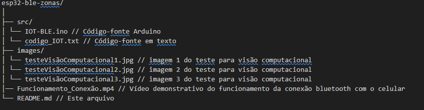

# ESP32 BLE Zonas Aleatórias

Projeto de comunicação BLE (Bluetooth Low Energy) usando ESP32, enviando zonas aleatórias para clientes BLE conectados. Ideal para testes de integração com aplicativos móveis, automação, IoT e rastreamento indoor em ambientes como pátios, estacionamentos ou laboratórios.

---

## 📖 Sumário

- [Autores](#Autores)
- [Link Video](#Link-video)
- [Objetivo](#objetivo)
- [Tecnologias Utilizadas](#tecnologias-utilizadas)
- [Pré-requisitos](#pré-requisitos)
- [Estrutura do Projeto](#estrutura-do-projeto)
- [Instruções de Instalação e Uso](#instruções-de-instalação-e-uso)
- [Funcionamento do Código](#funcionamento-do-código)
- [Resultados Parciais e Testes](#resultados-parciais-e-testes)

---

## 👨‍💻 Autores

- **Lu Vieira**
- **Diego Furigo**
- **Melissa Pereira**

---

## 📹 Link-video
[Link do Vídeo](https://youtu.be/zPu_VqiZK8s)

---
## 🎯 Objetivo

Demonstrar o uso de Bluetooth Low Energy (BLE) no ESP32 para notificação de zonas simuladas, sorteando valores de zona a cada 2 segundos e notificando clientes conectados. Este projeto pode servir como base para rastreamento de ativos, localização indoor e experimentos com IoT BLE.

---

## 🛠️ Tecnologias Utilizadas

- **ESP32** (ex: DevKit, Heltec WiFi LoRa 32, TTGO LoRa32)
- **Arduino IDE** (versão recomendada: 2.x)
- **Linguagem:** C++ (Arduino)
- **Bibliotecas:**
  - BLEDevice.h, BLEServer.h, BLEUtils.h, BLE2902.h (embutidas no core do ESP32)
- **Aplicativo cliente BLE:**  
  - nRF Connect, LightBlue Explorer (iOS/Android), Serial Bluetooth Terminal

---

## ⚙️ Pré-requisitos

- **Arduino IDE** instalado ([download](https://www.arduino.cc/en/software))
- **Suporte ao ESP32** instalado pela URL adicional nas Preferências:
https://raw.githubusercontent.com/espressif/arduino-esp32/gh-pages/package_esp32_index.json
https://resource.heltec.cn/download/package_heltec_esp32_index.json
- **Driver USB do ESP32** (CH340, CP2102, etc) instalado, se necessário
- **Cabo USB de dados** para conectar o ESP32 ao PC
- **Smartphone com app BLE** instalado

---

## 📁 Estrutura do Projeto

---

## 🚀 Instruções de Instalação e Uso

### 1. **Configurar Arduino IDE**

- Abra a IDE e vá em `Arquivo > Preferências`.
- Adicione a URL do ESP32 no campo “URLs Adicionais para Gerenciadores de Placas”.

### 2. **Instalar placa ESP32**

- Acesse `Ferramentas > Placa > Gerenciador de Placas`, pesquise por **esp32** e instale.

### 3. **Selecionar modelo da sua placa**

- Em `Ferramentas > Placa`, selecione o modelo exato do seu ESP32 (ex: Heltec WiFi LoRa 32).

### 4. **Abrir o código**

- Navegue até a pasta `src/` e abra o arquivo `IOT-BLE.ino` na IDE.

### 5. **Conectar ESP32 ao PC**

- Use um cabo de dados e aguarde aparecer a porta correta em `Ferramentas > Porta`.
- Se não aparecer, instale o driver necessário para seu modelo (ex: CH340/CP2102).

### 6. **Compilar e enviar para o ESP32**

- Clique no botão de Upload na IDE.
- Abra o **Monitor Serial** a 115200 baud para acompanhar logs.

### 7. **Conectar com App BLE**

- Abra um app BLE no celular (ex: nRF Connect).
- Busque pelo dispositivo chamado **Moto_01_v2**.
- Conecte e monitore a característica UUID:
4fafc201-1fb5-459e-8fcc-c5c9c331914b
- Veja as notificações com as zonas aleatórias a cada 2 segundos.

---

## 🔎 Funcionamento do Código

- O ESP32 anuncia um serviço BLE chamado **Moto_01_v2**.
- Ao conectar, o cliente BLE recebe notificações no formato `"ZONA:Xn"`, sorteando entre A1, A2, B1, B2, C1, C2.
- O intervalo entre notificações é de 2 segundos.
- O monitor serial exibe todos os eventos para debug.

---

## ✅ Resultados Parciais e Testes

- O dispositivo aparece corretamente em apps BLE.
- As zonas aleatórias são recebidas e exibidas em tempo real pelo app cliente.
- O código foi testado com ESP32 DevKit e TTGO LoRa32, funcionando conforme esperado.
- Não foi implementada autenticação BLE (conexão aberta para facilitar testes).

---

## 📚 Referências e Links Úteis

- [Documentação oficial ESP32 Arduino](https://docs.espressif.com/projects/arduino-esp32/en/latest/)
- [BLE no ESP32 - Guia prático](https://randomnerdtutorials.com/esp32-bluetooth-low-energy-ble-arduino-ide/)
- [nRF Connect para Android](https://play.google.com/store/apps/details?id=no.nordicsemi.android.mcp)
- [nRF Connect para iOS](https://apps.apple.com/us/app/nrf-connect-for-mobile/id1054362403)
- [Baixar driver CH340 (Windows)](https://www.wch.cn/downloads/CH341SER_EXE.html)

---

## 📎 Link para o Repositório

<https://github.com/luvieirasantos/iot.git>

---
